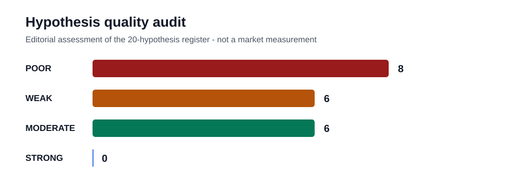
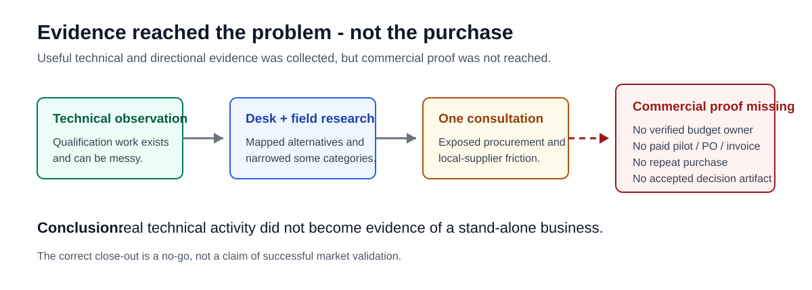

# ServerQual

**A closed exploratory business investigation into server / OS / platform qualification.**

> **Status: NO-GO — closed September 2026**  
> This repository is **not** evidence of a validated startup, a launched qualification service, or a proven market. It documents a technically plausible idea that expanded into a weak commercial hypothesis set, received limited external discovery, and was stopped.

## Candid bottom line

The technical activity behind ServerQual is real: server and platform qualification can involve configuration-specific compatibility work, firmware/driver interactions, regression testing, evidence collection, support boundaries, and multi-party coordination.

The business thesis was much weaker.

The original project moved too quickly from:

> **"This technical work is messy and important"**

to:

> **"A customer may pay an independent new provider for a separate qualification artifact or service."**

That purchase assumption was never established.

The revised hypothesis audit rates the **20-hypothesis set as POOR overall**:

- **8 Poor**
- **6 Weak**
- **6 Moderate**
- **0 Strong**

The six Moderate hypotheses were only better-formed and more testable. They were **not validated businesses**.

See the full [Hypothesis Quality Audit](docs/hypothesis-quality-audit.md).

## What was actually done

The project included:

- practical problem framing from prior Linux/server enablement and validation exposure
- desk research into server, OS, certification, support, and qualification ecosystems
- workflow and competitor/substitute mapping
- field observations at Taiwan industry events
- **one dedicated external practitioner consultation**
- limited informal field conversations
- a broad 20-item hypothesis register
- proposed service and evidence-artifact designs
- illustrative pricing, capacity, and cash-flow stress tests
- a documented no-go decision

A historical project record states that more than 70 official technical pages were screened. This repository does **not** independently re-audit that count, so it should be treated as a project-record claim rather than a newly verified metric.

## What was **not** established

The project did **not** establish:

- a verified economic buyer
- a customer-approved buying chain
- a paid pilot
- a purchase order or customer invoice
- repeat purchase
- a design partner
- a customer-approved delivery advantage
- acceptance of an independent qualification dossier in a real approval process
- a sufficiently narrow and differentiated beachhead
- evidence that the proposed economics survived actual sales and delivery

This distinction matters. Useful research artifacts are not commercial validation.

## Why the hypotheses were weak

### 1. The project began with a technical category, not one paid event

"Qualification is messy" is a domain observation. A business hypothesis needed one buyer, one live trigger, one costly consequence, and one decision that would change.

### 2. Twenty ideas mostly repeated the same unproven assumption

Different services still depended on the same core leap:

**Will a buyer trust an independent newcomer's evidence, act on it, and pay for it?**

That question should have been tested before expanding the idea set.

### 3. The register mixed incompatible logical levels

The project treated all of these as if they were equivalent hypotheses:

- customer jobs
- deliverables
- technical specialties
- monitoring/data products
- consulting services
- a shared-lab operating model

They were not equivalent.

### 4. Discovery capacity was too small for the search space

One dedicated consultation plus limited field conversations could not discriminate twenty markets or service models.

### 5. Falsification rules were weak

Most hypotheses did not begin with a pre-defined behavioral threshold such as:

- a qualified buyer shares a live change artifact
- a user introduces the actual budget owner
- a customer accepts a scoped proposal
- a customer pays for a pilot
- a named approver agrees that the output would change a real decision

Without a stop rule, research can continue long after the core assumption should have been rejected.

### 6. Pricing and financial models arrived before purchase evidence

Pricing ranges and cash-flow models can test feasibility. They do not demonstrate demand.

### 7. Several ideas violated the available resource boundary

Cross-OEM testing, air-gapped qualification, AI full-stack qualification, specialist performance tuning, and a shared lab would require combinations of:

- hardware access
- security trust
- specialist depth
- vendor relationships
- customer permissions
- capital

Those capabilities were not available to a solo new entrant.

## The cleaner hypotheses

The better-formed ideas were:

- **H01 — Exact-stack change qualification**
- **H03 — BOM / component substitution**
- **H11 — Procurement / delivery acceptance**
- **H12 — Workload performance regression**
- **H14 — Redfish / BMC conformance regression**
- **H16 — New OS-release readiness**

These were rated **Moderate**, not Strong. Each still lacked some combination of verified buyer, budget, channel ownership, accepted output, access, or paid commitment.

The poorest ideas were generally the ones that drifted furthest from a single customer decision:

- **H18 — Shared qualification laboratory:** an operating/capital model, not a customer hypothesis
- **H19 — BIOS / power / thermal / NUMA tuning:** a separate specialist engineering business
- **H20 — Cross-OEM compatibility intelligence:** a data product introduced before recurring action-linked demand was established

## Why the project was stopped

Existing alternatives already occupy much of the value chain:

- OEM/platform-vendor qualification and support
- OS and silicon-vendor certification/support programs
- internal validation and release teams
- system integrators
- established third-party labs

The remaining independent wedge was never demonstrated strongly enough to justify continued investment.

**Decision: do not proceed with ServerQual V1.**

The no-go is bounded. It does **not** mean server qualification has no market. It means this investigation did not establish a sufficiently narrow, differentiated, purchasable, and realistically deliverable entry point for this founder.

## What the project is worth now

The defensible value is narrower than the original repository implied.

ServerQual demonstrates that I:

- turned a broad technical observation into an explicit business investigation
- mapped workflows, substitutes, buyer roles, and resource constraints
- sought some external evidence
- recognized that the hypothesis portfolio itself was over-broad and under-specified
- stopped before committing to a lab, platform build, or fundraising effort

It does **not** demonstrate product-market fit, customer traction, or a successful validation program.

A more accurate portfolio description is:

> Conducted an independent exploratory business investigation into server/OS/platform qualification. Built a broad hypothesis register, then found that several assumptions were poorly specified or structurally weak: the first buyer, budget owner, accepted decision artifact, and delivery advantage were not established. Completed limited external discovery and closed the thesis before capital expenditure. The main outcome was a corrected hypothesis model and a documented no-go decision, not validation of a business.

## Better rule for the next business experiment

Before building another broad business plan, require:

1. **One buyer** — one role in one segment
2. **One trigger** — a current release, BOM change, failed support case, deadline, or maintenance event
3. **One decision** — approve, delay, buy, ship, escalate, or deploy
4. **One deliverable** — bounded and observably accepted
5. **One price test** — real money or another costly commitment
6. **One stop rule** — time-box the test and reject/rewrite if the behavioral threshold is not met

The practical correction is simple:

**test buyer behavior before expanding the business model.**

## Repository structure

- [Hypothesis quality audit](docs/hypothesis-quality-audit.md)
- [Close-out summary](docs/validation-summary.md)
- [Research method and limitations](docs/methodology.md)
- [Service framing history](docs/service-hypotheses.md)
- [Qualification dossier concept](docs/qualification-dossier-concept.md)

## Timeline

- **25 Aug 2026** — initial thesis and broad hypothesis mapping
- **Aug–Sep 2026** — desk research, field observations, and service reframing
- **21–22 Sep 2026** — dedicated practitioner consultation / transcript export
- **24–25 Sep 2026** — original commercial thesis closed
- **5 Oct 2026** — hypothesis-quality audit added; interpretation made more candid

---

## 中文摘要

ServerQual 是一個已結束的伺服器 / OS / 平台 qualification 商業探索專案。

最重要的修正是：**問題不只是「驗證資料不足」，而是原本的商業假設本身品質就偏弱。**

技術問題確實存在，但專案把「qualification 很複雜」太快推進成「客戶會付費購買獨立第三方的 qualification 證據或服務」。這個購買假設沒有被證明。

20 個假設的事後品質審核結果為：

- Poor：8
- Weak：6
- Moderate：6
- Strong：0

專案只有一次正式外部 practitioner consultation，加上有限的產業活動觀察；沒有付費 pilot、沒有驗證 budget owner、沒有 repeat purchase，也沒有證明客戶會把 ServerQual 的產出納入真實的 approval / procurement / release decision。

因此，最準確的結論不是「成功完成市場驗證」，而是：

**一次有用但假設設計偏弱的失敗探索；外部 discovery 有限；沒有完成商業驗證；但最後停止投入的決策是正確的。**
